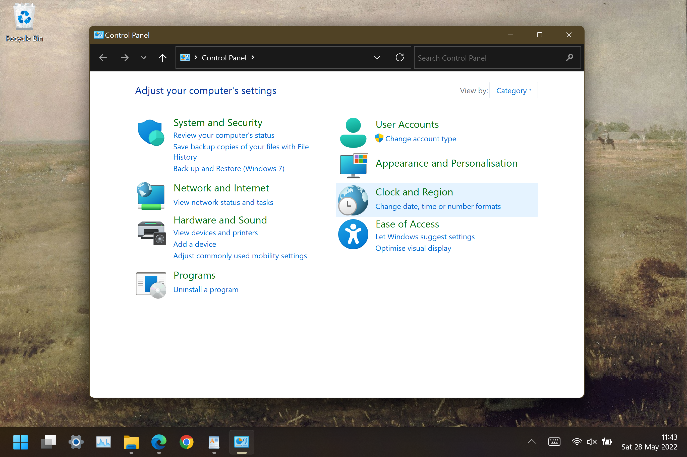
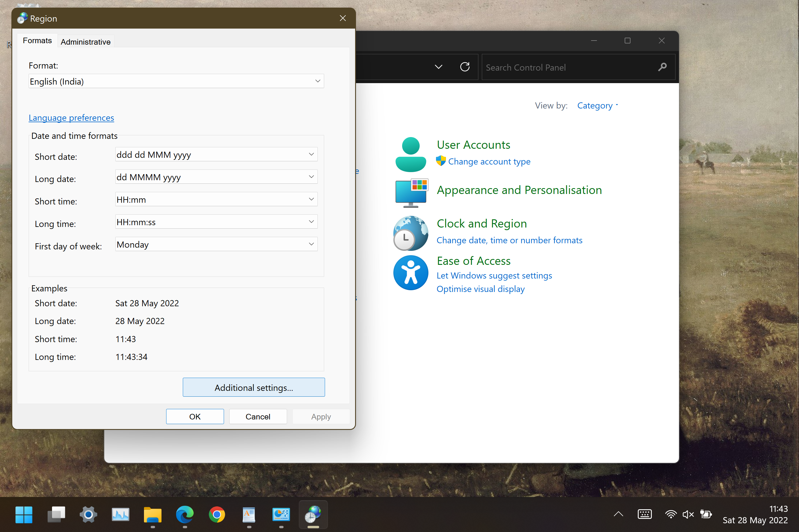
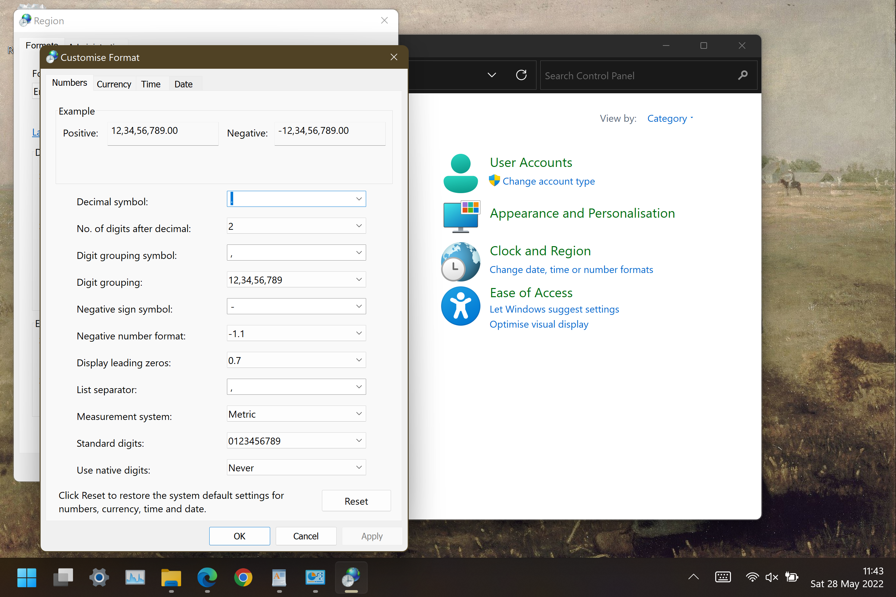

# [Change Date in Windows taskbar to a more pleasing format](https://anuragyayhdapu.github.io/win11-date-format/)

I wanted the Date in the Windows-11 Taskbar to show the Day of the Week with an abbreviated version of the Month, like **Wed 25 May 2022**.

The standard ISO format to achieve the above date display is **ddd dd MMM yyyy**.

Now, let's change the format.

### 1. Open **Control Panel** and select **Change date, time or number formats** under the **Clock and Region** heading.

### 2. In the opened **Region Window**, click on **Additional Settings** in the bottom right.

### 3. Click on the **Date** tab on top in the newly opened **Customise Format** window.

### 4. Replace the text against **Short Date** as **ddd dd MMM yyyy**.

### 6. Click **Apply** and then **OK**.
